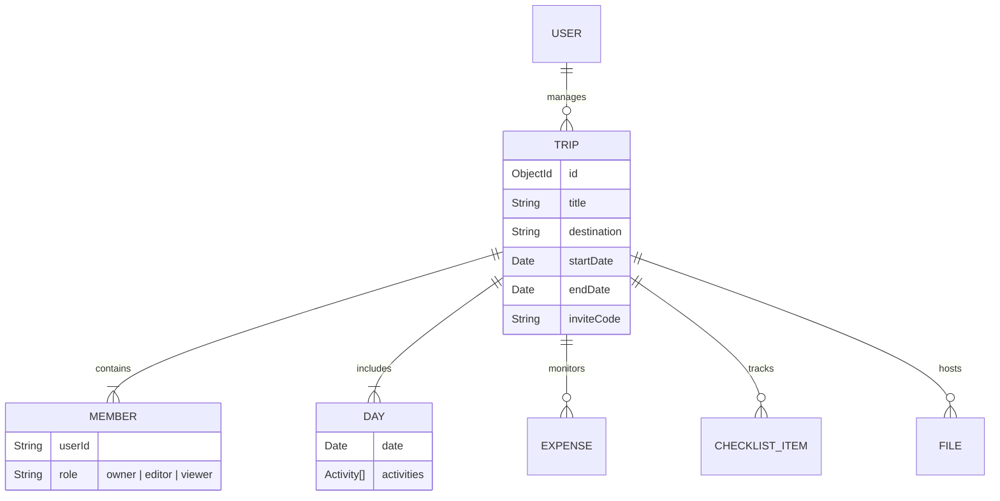

<div align="center">


# 🌏 Travio
### Collaborative Trip Planning, Reimagined.

[](https://nextjs.org/)
[](https://react.dev/)
[](https://tailwindcss.com/)
[](https://www.mongodb.com/)
[](https://opensource.org/licenses/MIT)

[**Live Demo**](https://travio.fun) • [**Watch Walkthrough**](https://youtu.be/lZED4XvoGQ0) • [**Documentation**](https://github.com/pranavgawaii/Travio#readme)

</div>

<br/>

## 📖 Overview

**Travio** is a high-performance, real-time collaborative platform engineered to eliminate the chaos of group travel planning. Unlike fragmented messaging threads or static spreadsheets, Travio provides a unified, premium workspace where travelers can co-create itineraries, manage shared expenses, and organize trip essentials in one cohesive dashboard.

Designed with a focus on **Visual Excellence** and **Seamless Interaction**, Travio bridges the gap between digital planning and real-world travel workflows.

---

## ✨ Key Features

### 🗓️ Smart Itinerary Builder
- **Dynamic Scheduling:** Build day-wise plans that automatically adjust to your trip duration.
- **Rich Activity Cards:** Categorize activities with precise timing, location data, and cost estimates.
- **Drag-and-Drop UX:** Intuitively reorder your day to optimize your travel flow.

### 👥 Real-Time Collaboration
- **Invite Engine:** Instant member onboarding via unique invite codes.
- **Role-Based Permissions (RBAC):** Granular access control for `Owners`, `Editors`, and `Viewers`.
- **Live State Sync:** Seamless updates across all participants using optimized React hydration patterns.

### 💰 Financial Intelligence
- **Global Expense Ledger:** Track who paid what and visualize total trip costs automatically.
- **Categorized Spending:** Understand where your budget is going with insightful summaries.

### 🎒 Essential Organization
- **Smart Checklists:** Real-time to-do and packing lists to ensure nothing is left behind.
- **Document Vault:** Securely attach digital tickets, PDFs, and confirmations via Cloudinary storage.

---

## 🛠️ Tech Stack

Designed using a modern, scalable architecture:

- **Frontend:** [Next.js 16](https://nextjs.org/) (App Router), [React 19](https://react.dev/), [Tailwind CSS 4](https://tailwindcss.com/)
- **State & Animation:** [Framer Motion](https://www.framer.com/motion/), [Radix UI](https://www.radix-ui.com/)
- **Backend:** Next.js Serverless Functions, [Node.js](https://nodejs.org/)
- **Database:** [MongoDB Atlas](https://www.mongodb.com/) with [Mongoose](https://mongoosejs.com/)
- **Authentication:** [Clerk](https://clerk.com/) (Edge Middleware Auth)
- **Infrastructure:** [Vercel](https://vercel.com/) (CI/CD), [Cloudinary](https://cloudinary.com/) (Media Hosting)

---

## 🧬 System Architecture

Travio follows a serverless MVC pattern optimized for low-latency interactions at the edge.



---

## 🚀 Getting Started

### Prerequisites
- **Node.js** v18 or higher
- **MongoDB Atlas** account
- **Clerk** account for Authentication

### Installation

1. **Clone the Project**
   ```bash
   git clone https://github.com/pranavgawaii/Travio.git
   cd Travio
   ```

2. **Install Dependencies**
   ```bash
   # Install all packages
   npm install --prefix frontend
   npm install --prefix backend
   ```

3. **Configure Environment**
   Create a `.env.local` in the `/frontend` directory:
   ```env
   NEXT_PUBLIC_CLERK_PUBLISHABLE_KEY=pk_test_...
   CLERK_SECRET_KEY=sk_test_...
   MONGODB_URI=mongodb+srv://...
   NEXT_PUBLIC_APP_URL=http://localhost:3000
   ```

4. **Launch Development**
   ```bash
   npm run dev --prefix frontend
   ```

---

## 👨‍💻 Developed By

**[Pranav Gawai](https://github.com/pranavgawaii)**  
*Full-Stack Engineer & Designer*

If you find Travio useful, please consider giving it a ⭐ on GitHub!

---

<div align="center">
  <p>© 2026 Travio Platform. Built for the modern traveler.</p>
</div>
