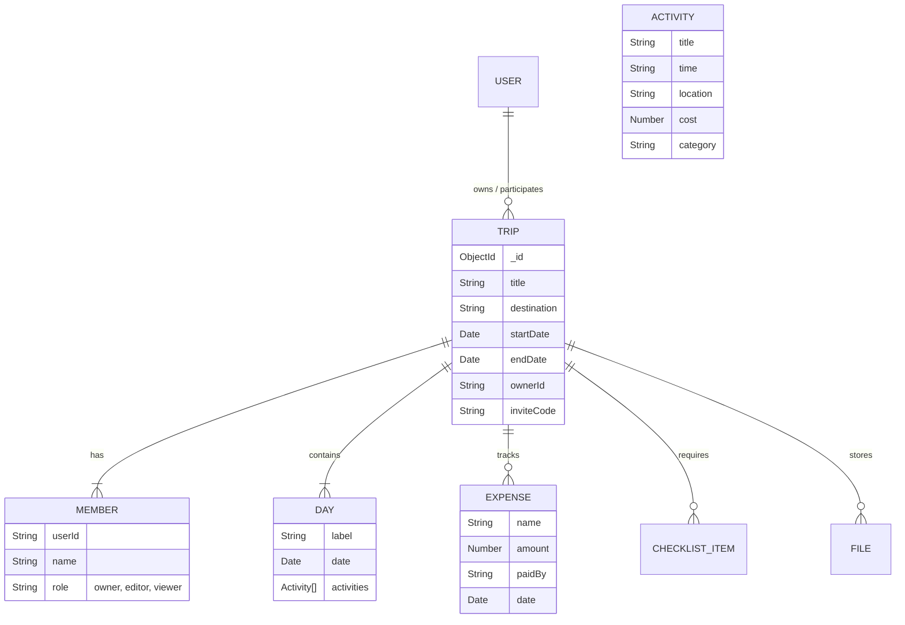

<div align="center">


# Travio
**Collaborative Trip Planning, Reimagined.**

*A submission for the Web Dev Cohort 2026 Buildathon — Problem Statement 3.*


<br/>


</div>

<br/>

## 🌍 Project Overview

**Travio** is a full-stack, real-time collaborative platform designed to orchestrate group travel without the friction. Built entirely from scratch to address **Problem Statement 3**, Travio shifts group trip planning away from disorganized WhatsApp chats and Google Sheets into a single, cohesive, premium dashboard. 

Travio maps exactly to the real-world workflow of modern travelers—managing complex states across day-wise itineraries, split budgets, checklist ownership, and role-based permissions simultaneously.

---

## ✨ Features Implemented (As per Hackathon Prompt)

### 📌 Trip Planning
- **Create Trip Workspace:** Users can instantiate trips with titles, dates, destinations, and a designated owner.
- **Day-Wise Itinerary Builder:** Dynamic scheduling of days based on the trip's start and end date.
- **Activity Cards:** Embedded activities per day, complete with timing, location mapping, cost assignment, and categorization.
- **Dynamic Reordering:** Intuitive logic mapping for sorting activities sequentially across a given day.

### 🤝 Collaboration
- **Invite Engine:** Seamlessly invite members via unique, instantly generated `inviteCodes`.
- **Role-Based Access Control (RBAC):** Strict authorization logic determining action capabilities for `Owner`, `Editor`, and `Viewer`.

### 🗂️ Organization & Financials
- **Budget Tracking & Expense Summary:** A global financial ledger tracking categorical expenses, defining "who paid what", and aggregating the trip's total cost.
- **Checklist Engine:** Real-time state management for packing and to-do lists to ensure no traveler forgets the essentials.
- **File Attachments:** Central vault for digital tickets, PDFs, and reservation confirmations via cloud storage.

<br/>

<div align="center">

</div>

<br/>

---

## 🧬 System Architecture & DB Schema

Travio utilizes a customized Model-View-Controller (MVC) serverless pattern. The backend routes act as microservices hosted on Next.js Edge infrastructure communicating natively with a **MongoDB** document instance.

### Database Schema (Entity Relationship)



---

## 🛠️ Security & Production Readiness

- **Resilient Auth:** Handled by [Clerk](https://clerk.com/) SDK at the edge middleware level. It securely redirects unauthorized users while allowing API routes to extract `userId` globally.
- **Data Integrity:** Mongoose schemas enforce strictly validated type casting.
- **Hydration & State Sync:** Optimized `useEffect` and React Context implementations for flawless hydration (preventing server-to-client UI breaking).

---

## 🚀 Setup Instructions

### Prerequisites
You will need Node.js (v18+), npm, and a MongoDB Cluster URI.

### 1. Clone the repository
```bash
git clone https://github.com/pranavgawaii/Travio.git
cd Travio
```

### 2. Install dependencies
Travio is structured as a monorepo internally utilizing modern package boundaries.
```bash
# Install Frontend
npm install --prefix frontend

# Install Backend dependencies
npm install --prefix backend
```

### 3. Environment Variables
Create a `.env.local` file inside the `/frontend` directory and provide the necessary credentials:
```env
NEXT_PUBLIC_CLERK_PUBLISHABLE_KEY=your_clerk_publishable_key
CLERK_SECRET_KEY=your_clerk_secret_key
MONGODB_URI=your_mongodb_cluster_uri
NEXT_PUBLIC_APP_URL=http://localhost:3000

NEXT_PUBLIC_CLERK_SIGN_IN_URL=/sign-in
NEXT_PUBLIC_CLERK_SIGN_UP_URL=/sign-up
NEXT_PUBLIC_CLERK_AFTER_SIGN_IN_URL=/dashboard
NEXT_PUBLIC_CLERK_AFTER_SIGN_UP_URL=/dashboard
```

### 4. Run the Application
Start the Next.js development server:
```bash
npm run dev --prefix frontend
```
The application will launch on [http://localhost:3000](http://localhost:3000).

---

<div align="center">
  
### 👨‍💻 Developed By

Engineered and designed by **[Pranav Gawai](https://github.com/pranavgawaii)** for the Chaicode Cohort 2026 Buildathon.

⭐ **If you find this project interesting or helpful, please consider giving it a star to show your support!**

<br/>

> *I confirm this submission is my original work product, solely owned by me, and does not violate the intellectual property rights of any other person or entity.*

</div>
